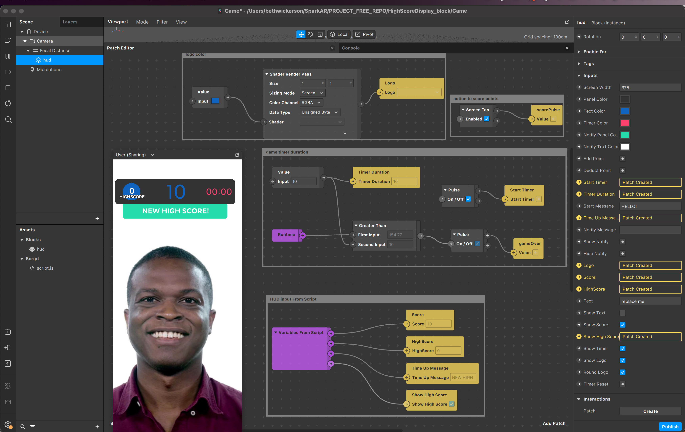

# High Score Display - Persistence Module example in Spark AR

Works well with the Spark AR game templates or use this as the starting point!. 

Learn more about scripting from the 

Make sure to add the FromScript and ToScript script variables when importing the script and block to a new file

